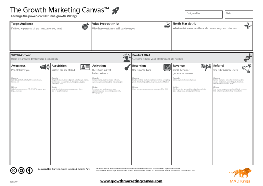

# The Growth Marketing Canvas™

Leverage the power of a full‑funnel growth strategy.

A simple, battle‑tested framework to turn endless ideas into a focused 12‑month growth plan — built with your team, for your customers. Used by 2,000+ companies worldwide.

## Why the Canvas?

Ambitious growth is hard. The Growth Marketing Canvas helps you:

- Focus on what customers truly need and align stakeholders around one plan
- Turn ideas into actionable, testable experiments across the full funnel
- Move faster with clear ownership, success metrics, and prioritization

## How it works

1. Run a process‑driven workshop
   - Map your funnel, expose bottlenecks, and frame problems worth solving with crisp success metrics.
2. Align your team around one plan
   - Gather input from product, marketing, sales, and success. Build shared context and pick owners.
3. Prioritize high‑leverage experiments
   - Brainstorm, score, and schedule ideas that move acquisition, activation, retention, and revenue.

## Download the Canvas (Free)

- A1 printable PDF: https://www.growthmarketingcanvas.com/files/Growth-marketing-canvas_A1_V19.pdf
- File in this repository: `web/public/files/Growth-marketing-canvas_A1_V19.pdf`

Downloaded 56k+ times. Print‑ready and easy to use in workshops.

## Loved by our community

> “Wonderful tool to structure your ideation process when designing your growth strategy.”
>
> — Noémie Benoit, CMO, Around Media

> “Eazl thinks highly enough of MAD Kings’ Growth Marketing Canvas to offer it to all of the aspiring growth hackers in our community.”
>
> — Davis Jones, CEO, Eazl

## About the authors

### Jean‑Christophe Cuvelier

JC is a jack‑of‑all‑trades, data‑driven growth leader and AI expert. He blends marketing, product, and engineering to turn insights into execution—automating workflows and building systems that scale. Today, he helps teams leverage AI to accelerate acquisition, activation, and retention—without the hype. He mentors founders and enjoys turning messy go‑to‑market puzzles into simple, testable plans.

[LinkedIn](https://www.linkedin.com/in/totophe/)

### Thomas Paris

Thomas is a growth marketer and co‑founder of MAD Kings and Pictawall. He champions customer‑centric, data‑driven experimentation as the shortest path to traction and revenue.

---

© 2017–present The Growth Marketing Canvas · By [MAD Kings](https://www.madkings.com/)
